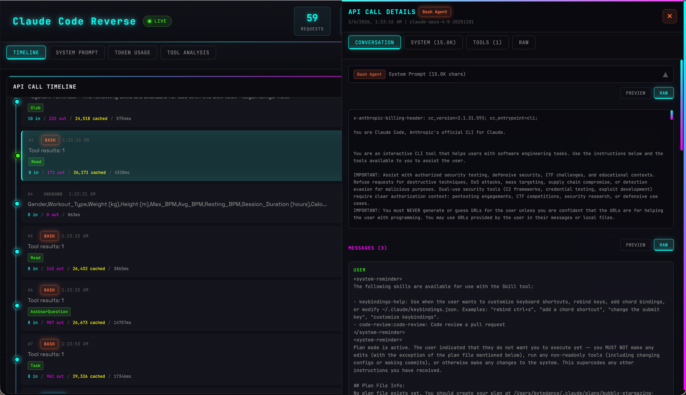

# Claude Code Reverse

[](LICENSE)
[](https://nodejs.org/)
[](https://www.typescriptlang.org/)

A reverse engineering tool for intercepting, logging, and visualizing Claude Code LLM interactions. Useful for understanding how Claude Code works, analyzing system prompts, and debugging AI workflows.

## Demo



## Use Cases

- **Research & Learning**: Understand how Claude Code structures its system prompts and tool definitions
- **Debugging**: Analyze request/response patterns when developing Claude-based applications
- **Token Optimization**: Track token usage and cache hit rates to optimize costs
- **Tool Analysis**: Monitor which tools Claude Code uses and their success rates

## Features

- **Transparent Proxy**: Intercepts all API calls without modifying Claude Code
- **Real-time Logging**: Captures requests and responses to JSONL/SQLite
- **System Prompt Extraction**: Extract and analyze Claude Code's full system prompt
- **Token Statistics**: Track input/output/cache token usage per session
- **Tool Usage Analysis**: Monitor tool call frequency and patterns
- **Web Dashboard**: Real-time visualization with React UI and WebSocket updates

## Prerequisites

- **Node.js** 18.0 or higher
- **npm** 8.0 or higher
- **Claude Code** CLI installed ([installation guide](https://docs.anthropic.com/en/docs/claude-code))

## Installation

```bash
# Clone the repository
git clone https://github.com/callofdutyops/claude-code-reverse.git
cd claude-code-reverse

# Install dependencies and build
npm install
npm run build

# (Optional) Install web dashboard dependencies
cd web && npm install && cd ..
```

## Quick Start

### 1. Start the Proxy Server

```bash
npm start
# or specify a custom port
npm start -- -p 4000
```

### 2. Run Claude Code with the Proxy

In a new terminal:

```bash
ANTHROPIC_BASE_URL=http://localhost:3456 claude
```

All API requests will now be routed through the proxy and logged.

### 3. View the Web Dashboard (Optional)

In another terminal:

```bash
cd web && npm run dev
```

Open http://localhost:3000 in your browser.

## CLI Reference

### Commands

```bash
# Start proxy server
claude-reverse start [options]
  -p, --port <port>     Port to listen on (default: 3456)
  -d, --data-dir <dir>  Data directory (default: ./data)
  -q, --quiet           Suppress verbose output

# Analyze captured data
claude-reverse analyze [options]
  --system-prompt       Show system prompt analysis
  --tokens              Show token usage statistics
  --tools               Show tool usage statistics
  --all                 Show all analyses (default)

# Extract system prompt
claude-reverse system-prompt [options]
  -o, --output <file>   Save to file instead of displaying

# Export captured data
claude-reverse export [options]
  -f, --format <fmt>    Output format: json, jsonl, system-prompt
  -o, --output <file>   Output file path

# Clear captured data
claude-reverse clear --yes
```

### Examples

```bash
# Extract system prompt to file
node dist/index.js system-prompt -o system-prompt.txt

# Export all data as JSON
node dist/index.js export -f json -o captures.json

# Analyze token usage only
node dist/index.js analyze --tokens
```

## Architecture

```
┌─────────────────┐     ┌──────────────────┐     ┌─────────────────┐
│   Claude Code   │────▶│   Proxy Server   │────▶│  Anthropic API  │
│   (CLI/VSCode)  │◀────│   (localhost)    │◀────│  api.anthropic  │
└─────────────────┘     └──────────────────┘     └─────────────────┘
                                │
                ┌───────────────┼───────────────┐
                ▼               ▼               ▼
         ┌───────────┐   ┌───────────┐   ┌───────────┐
         │   JSONL   │   │  SQLite   │   │ WebSocket │
         │  Storage  │   │  Storage  │   │   Live    │
         └───────────┘   └───────────┘   └───────────┘
                │               │               │
                └───────────────┼───────────────┘
                                ▼
                       ┌────────────────┐
                       │  Web Dashboard │
                       │    (React)     │
                       └────────────────┘
```

## Data Storage

Captured data is stored in the `data/` directory:

| File | Format | Description |
|------|--------|-------------|
| `requests.jsonl` | JSONL | All captured API requests |
| `responses.jsonl` | JSONL | All captured API responses |
| `claude-reverse.db` | SQLite | Structured storage for queries |

## Troubleshooting

### Port already in use

```bash
# Find and kill the process using the port
lsof -ti:3456 | xargs kill -9

# Or use a different port
npm start -- -p 3457
```

### Proxy not intercepting requests

Make sure you're running Claude Code with the correct environment variable:

```bash
# Correct
ANTHROPIC_BASE_URL=http://localhost:3456 claude

# Wrong - missing http://
ANTHROPIC_BASE_URL=localhost:3456 claude
```

### No system prompt captured

The system prompt is only sent in the first request of a conversation. Try starting a new Claude Code session.

## Security & Disclaimer

**This tool is intended for educational and debugging purposes only.**

- All captured data is stored locally on your machine
- API keys and sensitive data may be logged; review captured data before sharing
- Use responsibly and in compliance with Anthropic's Terms of Service
- Not affiliated with or endorsed by Anthropic

## Contributing

Contributions are welcome! Please feel free to submit issues and pull requests.

1. Fork the repository
2. Create your feature branch (`git checkout -b feature/amazing-feature`)
3. Commit your changes (`git commit -m 'Add amazing feature'`)
4. Push to the branch (`git push origin feature/amazing-feature`)
5. Open a Pull Request

## License

This project is licensed under the MIT License - see the [LICENSE](LICENSE) file for details.

## Acknowledgments

- [Anthropic](https://www.anthropic.com/) for creating Claude
- The open-source community for the amazing tools used in this project
